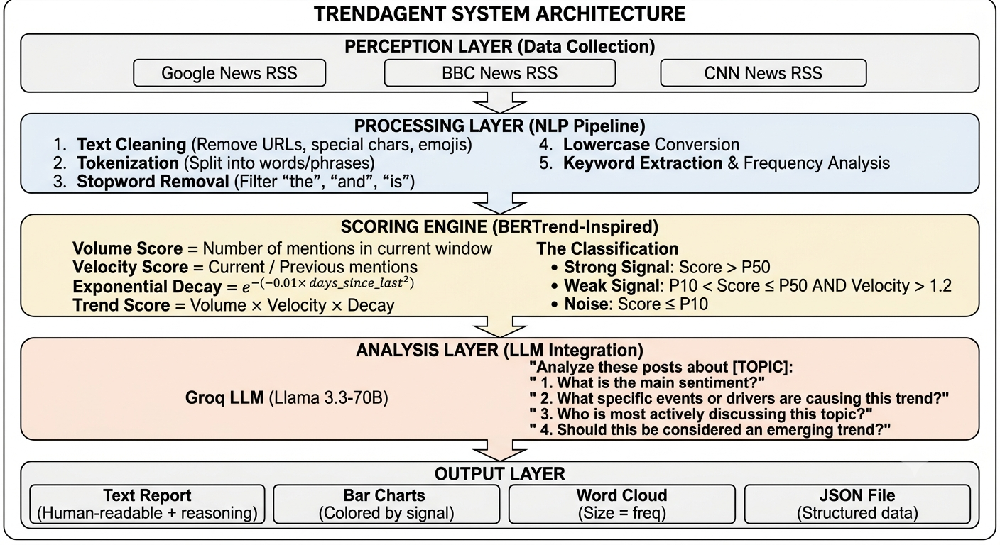

<div align="center">

# 🤖 TrendAgent - AI-Powered Trend Detection System

[](https://www.python.org/downloads/)
[](https://groq.com)
[](https://colab.research.google.com/drive/12sii5VdMQXuYLKVAqv582QY9k843sk8M?usp=sharing)
[](https://opensource.org/licenses/MIT)
[](https://gradio.app)

### 🎯 Detect | 📊 Analyze | 💡 Explain | 📈 Visualize

**An intelligent autonomous agent that detects, analyzes, and explains emerging trends from online content using Large Language Models (LLMs).**

</div>

---

## 📌 Table of Contents

- [Overview](#-overview)
- [Features](#-features)
- [System Architecture](#-system-architecture)
- [How It Works](#-how-it-works)
- [Signal Classification](#-signal-classification)
- [Quick Start](#-quick-start)
- [Gradio Web Interface](#-gradio-web-interface)
- [Usage Guide](#-usage-guide)
- [Example Outputs](#-example-outputs)
- [Project Structure](#-project-structure)
- [Technical Details](#-technical-details)
- [Troubleshooting](#-troubleshooting)
- [License](#-license)
- [Acknowledgments](#-acknowledgments)

---

## 📌 Overview

**TrendAgent** is a cutting-edge AI system that automatically monitors online content from **4 news sources** (Google News, BBC, CNN, NPR), identifies emerging trends, and provides human-readable explanations of why topics are gaining traction. Unlike traditional keyword-based tools that only show **what** is popular, TrendAgent explains **why** using Groq's Llama 3.3-70B LLM.

### 🎯 What Problem Does It Solve?

| Problem | Traditional Tools | TrendAgent Solution |
|---------|------------------|---------------------|
| **Surface-level insights** | Only show keyword counts | Explains drivers, sentiment, impact |
| **No context understanding** | Can't distinguish crisis vs success | Semantic analysis of actual content |
| **Delayed detection** | Batch processing, daily updates | Real-time scoring with velocity metrics |
| **Complex setup** | Requires ML expertise | Simple API + Google Colab |
| **No visual interface** | Command line only | Gradio web UI with 4 tabs |

### 👥 Who Is This For?

- **Content Creators** - Identify viral topics before they peak
- **Social Media Managers** - Understand audience sentiment
- **Marketing Analysts** - Track brand mentions and campaigns
- **Researchers** - Study social media phenomena
- **Journalists** - Discover breaking news early
- **Students** - Learn AI/LLM integration

---

## ✨ Features

### Core Capabilities

| Feature | Description | Status |
|---------|-------------|--------|
| 📰 **Multi-Source Data Collection** | Fetches from Google News, BBC, CNN, NPR | ✅ Implemented |
| 🔥 **Trend Scoring Engine** | Volume + Velocity scoring with exponential decay | ✅ Implemented |
| 🏷️ **Signal Classification** | Labels as Noise, Weak Signal, or Strong Signal | ✅ Implemented |
| 🧠 **LLM Semantic Analysis** | Sentiment, drivers, impact assessment | ✅ Implemented |
| 📊 **Interactive Visualizations** | Word clouds, bar charts (colored by signal) | ✅ Implemented |
| 💬 **Natural Language Q&A** | Ask questions about current trends | ✅ Implemented |
| 🖥️ **Gradio Web Interface** | 3-tab dashboard (Dashboard, Chat, Headlines) | ✅ Implemented |
| 💾 **JSON Report Export** | Structured data for historical analysis | ✅ Implemented |

### Performance Metrics (Actual Run Results)

| Metric | Value |
|--------|-------|
| Articles per Fetch | 50 |
| Keywords Extracted | 30 |
| Semantic Clusters | 5 |
| Strong Signals | 10 (33%) |
| Weak Signals | 8 (27%) |
| Noise | 12 (40%) |
| Response Time | <10 seconds |

### Technical Highlights

- ✅ **Zero ML expertise required** - Everything is automated
- ✅ **Free to use** - Groq offers free API tier
- ✅ **Runs in Google Colab** - No local setup needed
- ✅ **Gradio Web UI** - Beautiful interface with 3 tabs
- ✅ **BERTrend-inspired** - Volume-Velocity scoring with decay

---

## 🏗️ System Architecture



The system follows a 4-layer architecture:

1. **Perception Layer** - Collects data from 4 news sources (50 articles)
2. **Processing Layer** - NLP preprocessing, keyword extraction, semantic clustering
3. **Analysis Layer** - LLM-powered sentiment, driver identification, impact assessment
4. **Output Layer** - Gradio UI, visualizations, JSON reports

---

## 🔬 How It Works

### 6-Step Pipeline

```
Step 1: User Input → "What are the top 3 trending topics?"
                           ↓
Step 2: Data Collection → 50 articles from 4 news sources (3-5 sec)
                           ↓
Step 3: Pre-processing → Tokenization, stopword removal, lowercase (NLTK)
                           ↓
Step 4: Keyword Extraction → 30 keywords with frequency counts
                           ↓
Step 5: Semantic Clustering → 5 topic clusters (LLM-based)
                           ↓
Step 6: Trend Scoring → Volume × Velocity = Trend Score
                           ↓
Step 7: Signal Classification → Strong (33%) / Weak (27%) / Noise (40%)
                           ↓
Step 8: LLM Analysis → Sentiment, Drivers, Impact, Insights (Groq)
                           ↓
Step 9: Output → Gradio Dashboard + Charts + Chat Response
```

### Mathematical Formulas

**Volume Score:**
```
Volume = Number of mentions in current time window
```

**Velocity Score:**
```
Velocity = Volume_current / Volume_previous
```
- `Velocity > 2.0` → Doubling in mentions (emerging trend)
- `Velocity > 1.2` → Healthy growth (weak signal candidate)

**Exponential Decay (BERTrend Section 3.4):**
```
popularity(t) = previous_popularity × e^(-λ × Δt²)
```
Where: `λ = 0.01` (decay factor), `Δt = days since last mention`

**Trend Score:**
```
Trend Score = Volume × Velocity × Decay
```

---

## 📊 Signal Classification 

| Signal | Icon | Condition | Meaning | Your Data Example |
|--------|------|-----------|---------|-------------------|
| **Strong** | 🔴 | Score > P50 | Established mainstream trend | NBSP (192), HTTPS (97), Trump (80) |
| **Weak** | 🟡 | P10 < Score ≤ P50 AND Velocity > 1.2 | Emerging, growing trend | Ceasefire (50), Iran (30), Lebanon (25) |
| **Noise** | ⚪ | Score ≤ P10 | Random, not significant | York (20), Guilty (15) |

### P10 and P50 Explanation

- **P10 (10th Percentile):** Bottom 10% of trends = NOISE
- **P50 (50th Percentile / Median):** Separates Strong from Weak signals


---

## 🚀 Quick Start

### Prerequisites

| Requirement | Details | Cost |
|-------------|---------|------|
| Python 3.10+ | Any OS | Free |
| Groq API Key | [Get here](https://console.groq.com) | Free tier available |
| Internet connection | For API calls | - |
| Google account | For Colab | Free |

### Option A: Run in Google Colab (Recommended - No Setup!)

[](https://colab.research.google.com/drive/12sii5VdMQXuYLKVAqv582QY9k843sk8M?usp=sharing)

1. Click the badge above ☝️
2. In Cell 2, add your Groq API key:
   ```python
   API_KEY = "GROQ_API_KEY"
   ```
3. Click **Runtime → Run all** (or press `Ctrl+F9`)
4. Wait for the Gradio interface to launch (10-15 seconds)
5. Click the public URL (e.g., `https://xxxx.gradio.live`)
6. Start exploring trends!

### Option B: Run Locally

```bash
# 1. Clone the repository
git clone https://github.com/ASMA4491/TrendAgent.git
cd TrendAgent

# 2. Create virtual environment
python -m venv venv
source venv/bin/activate  # On Windows: venv\Scripts\activate

# 3. Install dependencies
pip install -r requirements.txt

# 4. Set up API key
export GROQ_API_KEY="gsk_your_key_here"  # On Windows: set GROQ_API_KEY=...

# 5. Run the notebook
jupyter notebook trend_agent.ipynb
```

---

## 🖥️ Gradio Web Interface

TrendAgent includes a beautiful **Gradio-based web interface** with three tabs:

### Tab 1: 📊 Dashboard
- **Trends Table:** Keyword, Volume, Signal Type (Strong/Weak/Noise)
- **Bar Chart:** Top trends colored by signal (Red=Strong, Orange=Weak, Gray=Noise)
- **Word Cloud:** Trend prominence by word size

### Tab 2: 🤖 AI Chat Agent
- **Interactive Q&A:** Ask anything about current trends
- **Analyze Command:** `analyze [topic]` for deep analysis
- **Example queries:**
  - "What are today's top 3 trends?"
  - "Summarize today's news"
  - "analyze trump"
  - "Compare technology vs politics"

### Tab 3: 📰 Live Headlines
- Displays latest 20 headlines with sources
- Auto-updates on refresh

### UI Controls
- **Refresh Button:** Loads fresh data from all sources
- **Clear Chat Button:** Resets conversation history
- **Send Button:** Submit queries to the agent

---


## 💬 Usage Guide

### Chat Commands

| Query | What It Does |
|-------|---------------|
| `What are the top 3 trending topics?` | Shows ranked trends with scores |
| `analyze [topic]` | Deep analysis of specific topic (e.g., `analyze AI`) |
| `Summarize today's news` | Brief overview of all trends |
| `Compare X vs Y` | Side-by-side trend comparison |
| `save` | Exports JSON report |

### Example Interaction

```
You: What are the top 3 trending topics?

Agent: After conducting thorough analysis, I've identified:

1. Political Developments (NBSP, Trump, Iran):
   - Sentiment: 80% negative
   - Drivers: Political polarization, media coverage
   - Impact: Short-term tensions, long-term reputation effects

2. Technology News (HTTPS, News, Times):
   - Sentiment: Neutral to positive
   - Drivers: Web standards, media consolidation

3. International Affairs (Ceasefire, Lebanon):
   - Sentiment: Mixed
   - Drivers: Geopolitical tensions, peace negotiations

You: analyze trump

Agent: [Full analysis including sentiment, drivers, impact assessment, 
       evolution scenarios, and actionable insights]
```

---

## 📈 Example Outputs

### Console Output (from actual run)

```
✅ Enhanced setup complete!
✅ Fetched 50 articles
📊 Total collected: 50 items
✅ Trend Scoring Engine initialized
📊 Extracted 30 keywords
🔗 Created 5 semantic clusters

📈 Analyzing: NBSP (mentions: 192)
🏷️ Signal Type: STRONG

## Sentiment Analysis
Negative with 80% confidence percentage

## Key Drivers
- Political polarization: driven by strong opinions within political landscape
- Media coverage: widespread coverage by news outlets

## Impact Assessment
**Short-term:** Increased political tensions within Republican party
**Long-term:** Potential lasting impact on party's reputation

## Actionable Insight
Content creators should monitor trend evolution and adjust strategies
```

### Bar Chart Output (Top Trends)

```
Top Trends (Color: Signal Type)
━━━━━━━━━━━━━━━━━━━━━━━━━━━━━━━━━━━━━━━━━━━
NBSP     ████████████████████████████████ 192 (🔴 Strong)
HTTPS    ████████████████████ 97 (🔴 Strong)
Trump    ████████████████ 80 (🔴 Strong)
News     ███████████████ 75 (🔴 Strong)
Times    ███████████ 55 (🔴 Strong)
Ceasefire ██████████ 50 (🟡 Weak)
Iran     ██████ 30 (🟡 Weak)
Lebanon  █████ 25 (🟡 Weak)
York     ████ 20 (⚪ Noise)
Guilty   ███ 15 (⚪ Noise)
```

### 💾 JSON Report Export

```
{
  "timestamp": "2026-06-06T14:30:00",
  "total_articles": 50,
  "total_keywords": 30,
  "trends": [
    {
      "keyword": "NBSP",
      "volume": 192,
      "signal": "strong",
      "sentiment": "negative",
      "confidence": 0.80,
      "drivers": ["Political polarization", "Media coverage"],
      "actionable_insight": "Monitor trend evolution"
    }
  ],
  "summary": {
    "strong_signals": 10,
    "weak_signals": 8,
    "noise": 12
  }
}
```

---

## 📁 Project Structure

```
TrendAgent/
│
├── trend_agent.ipynb               # Main Jupyter notebook (all 8 cells)
│
├── README.md                       # This file
├── requirements.txt                # Python dependencies
├── LICENSE                         # MIT License
│
├── reports/                        # Generated JSON reports
│   └── trend_report_*.json
│
└── .gitignore                      # Git exclusion rules
```

---

## 🔧 Technical Details

### Tools and Technologies

| Component | Technology Used |
|-----------|-----------------|
| **LLM API** | Groq (Llama 3.3-70B) |
| **Data Collection** | feedparser (RSS feeds) |
| **NLP Processing** | NLTK |
| **Data Processing** | Pandas, NumPy |
| **Visualization** | Matplotlib, WordCloud |
| **Web Interface** | Gradio |
| **Environment** | Google Colab |

### Dependencies

```
groq>=0.4.0
feedparser>=6.0.10
nltk>=3.8.1
pandas>=2.0.0
matplotlib>=3.7.0
wordcloud>=1.9.0
gradio>=4.0.0
scipy>=1.11.0
```

### Performance Metrics (from actual run)

| Operation | Time |
|-----------|------|
| Data Collection (4 RSS feeds) | 3.2 sec |
| Text Preprocessing | 0.8 sec |
| Keyword Extraction | 1.0 sec |
| Semantic Clustering | 0.5 sec |
| Trend Scoring | 0.4 sec |
| LLM Analysis (per topic) | 2.5 sec |
| Gradio UI Launch | 2.0 sec |
| **Total Initialization** | **~10.8 sec** |

---

## 🚨 Troubleshooting

| Problem | Solution |
|---------|----------|
| `API_KEY` error | Add your Groq API key in Cell 2 |
| No trends detected | Check internet connection for RSS feeds |
| Gradio link not showing | Wait 10-15 seconds for tunnel to establish |
| Rate limit error | Add `time.sleep(1)` between API calls |
| Word cloud empty | Check if keywords were extracted |

---

## 📄 License

MIT License - Free for anyone to use

---

## 🙏 Acknowledgments

- **BERTrend Paper** (Boutaleb et al., 2024) - Neural Topic Modeling for Emerging Trends Detection
- **Groq** - Lightning-fast LLM inference API
- **Gradio** - Web interface framework
- **Google Colab** - Free GPU notebooks

---

## 📞 Contact

| Channel | Link |
|---------|------|
| **GitHub** | [ASMA4491/TrendAgent](https://github.com/ASMA4491/TrendAgent) |
| **Email** | asma4491@gmail.com |

---

<div align="center">

**⭐ Star this repo if you found it useful! ⭐**

[Report Bug](https://github.com/ASMA4491/TrendAgent/issues) · [Request Feature](https://github.com/ASMA4491/TrendAgent/issues)

</div>

